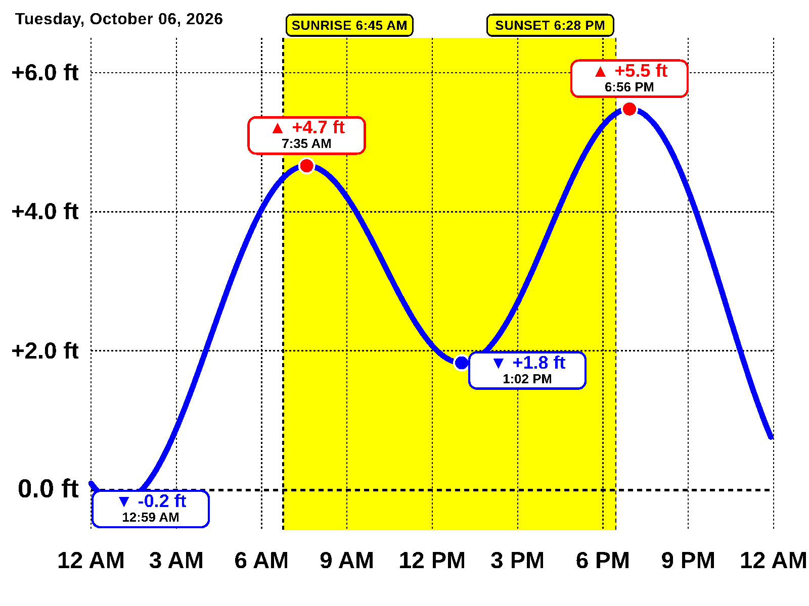

# Encinitas Ocean Tide Calendar

An automated, high-aesthetic ocean tide calendar for **Encinitas, California** running on a Raspberry Pi and displayed on a **Seeed reTerminal E1004** (13.3-inch E Ink Spectra 6 color e-paper display) running the [`epd-photoframe`](https://github.com/Frans-Willem/epd-photoframe) firmware.



---

## Hardware & Software Overview

| Component | Detail |
| :--- | :--- |
| **Display Device** | **Seeed reTerminal E1004** (ESP32-S3 + 13.3″ Spectra 6 panel, 1600×1200 Landscape) |
| **Device Firmware** | `epd-photoframe` (ESP32 deep-sleep photo frame firmware) |
| **Server Host** | **Raspberry Pi** (fetches NOAA data, renders HTML/SVG, applies Spectra 6 dithering, serves HTTP) |
| **Tide Station** | **NOAA CO-OPS Station 9410230** (La Jolla / Scripps Pier — official reference for Encinitas / Swami's / Moonlight Beach) |
| **Tidal Datum** | **MLLW** (Mean Lower Low Water) |

---

## Features

- **24-Hour Harmonic Tide Curve**: Plotted using NOAA 6-minute harmonic predictions with high-contrast callout badges for High and Low extrema.
- **Daylight & Solar Schedule**: Accurate sunrise, sunset, first light (civil dawn), and last light (civil dusk) for Encinitas coordinates (`33.037° N, 117.292° W`).
- **Lunar Cycle Card**: Real-time moon illumination percentage, phase name, vector moon graphic, and Spring/Neap tide indicator.
- **5-Day Outlook**: Daily high and low predictions and lunar discs for the upcoming week of surf, beach walks, or boating.
- **Spectra 6 Palette Optimization**: Dithered using Floyd-Steinberg error diffusion against the exact 6 pigment colors of the E1004 (Black, White, Red, Yellow, Blue, Green), eliminating background noise and keeping fonts razor-sharp.
- **Deep Sleep Integration**: Sends the HTTP `Refresh:` header so the reTerminal E1004 sleeps between updates to maximize battery life.
- **Device Telemetry**: Logs device battery percentage, battery voltage, temperature, and humidity sent by the E1004.
- **Web Preview**: Open `http://<pi-ip>:8080/` in any laptop or phone browser for an instant live view.

---

## Architecture

```
                                      +---------------------------------------------+
                                      |                 Raspberry Pi                |
[NOAA CO-OPS API]                     |                                             |
   Station 9410230 ------------------>|  1. fetcher.py (6-min curve & extrema)      |
                                      |  2. astronomy.py (Solar & Moon phases)      |
                                      |  3. renderer.py (HTML/SVG -> 1600x1200 PNG) |
                                      |  4. Spectra 6 Quantizer & Ditherer          |
                                      |  5. server.py (HTTP Server on port 8080)    |
                                      +----------------------+----------------------+
                                                             |
                                                             | HTTP GET /screen/encinitas-tide
                                                             | Returns: 1600x1200 paletted PNG
                                                             | Header: Refresh: 14400 (sleep 4h)
                                                             v
                                              +------------------------------+
                                              |    Seeed reTerminal E1004    |
                                              |    (13.3" Spectra 6 e-Paper) |
                                              |  Running epd-photoframe      |
                                              +------------------------------+
```

---

## Raspberry Pi Installation

### Automated Setup
Clone the repository to your Raspberry Pi and run the setup script:

```bash
git clone https://github.com/jeremyrode/tidecalendar.git
cd tidecalendar
chmod +x setup_service.sh
./setup_service.sh
```

This will:
1. Install system dependencies (`chromium-browser`, `python3-venv`).
2. Create a Python virtual environment and install dependencies.
3. Configure and start a `systemd` service (`tidecalendar.service`) that automatically launches at boot and restarts on failure.

---

### Manual Setup & Running

```bash
# 1. Install Chromium
sudo apt-get install -y chromium-browser

# 2. Install Python requirements
pip install -r requirements.txt

# 3. Test image generation
python renderer.py

# 4. Start HTTP server
python server.py
```

---

## reTerminal E1004 Configuration

1. Flash your reTerminal E1004 with the `epd-photoframe` firmware (`cargo run --release --bin e1004`).
2. On first boot, connect your smartphone or laptop to the WiFi hotspot named **`epd-photoframe-setup-XXXX`**.
3. Open `http://192.168.4.1/` in your browser.
4. Enter:
   - Your local **WiFi SSID** and **Password**.
   - **Image URL**:
     ```text
     http://<RASPBERRY_PI_IP>:8080/screen/encinitas-tide
     ```
     *(Replace `<RASPBERRY_PI_IP>` with your Pi's local network IP, e.g., `192.168.1.150`)*.
5. Save settings. The reTerminal E1004 will connect, fetch the 1600×1200 tide calendar, refresh the Spectra 6 screen, and enter deep sleep until the next scheduled update!

---

## Endpoints

| Endpoint | Description |
| :--- | :--- |
| `GET /screen/encinitas-tide` | Primary endpoint for reTerminal E1004. Returns 1600×1200 paletted PNG with `Refresh:` header. |
| `GET /` or `GET /preview` | Live interactive HTML preview for desktop and mobile browsers. |
| `GET /screen/raw.png` | Full 24-bit RGB PNG (pre-dithered). |
| `GET /refresh` | Forces an immediate NOAA re-fetch and image regeneration. |
| `GET /api/status` | JSON endpoint returning server status, last render time, and E1004 telemetry (battery, temp, humidity). |

---

## Configuration (`config.yaml`)

Edit `config.yaml` to customize behavior:

```yaml
display:
  orientation: "landscape"
  width: 1600
  height: 1200
  palette_mode: "spectra6" # "spectra6" for e-paper, "rgb" for full color

location:
  name: "Encinitas, California"
  sub_name: "Swami's • Moonlight Beach • San Elijo"
  latitude: 33.037
  longitude: -117.292

server:
  host: "0.0.0.0"
  port: 8080
  refresh_interval_seconds: 14400 # 4 hours (14400) or daily (86400)
```

---

## Project Structure

```
tidecalendar/
├── config.yaml               # User configuration (location, NOAA, server)
├── astronomy.py              # Pure Python solar & lunar phase engine
├── fetcher.py                # NOAA CO-OPS API data fetcher with disk caching
├── renderer.py               # HTML/SVG renderer, Chromium capture & Spectra 6 dithering
├── server.py                 # HTTP server with telemetry logging & Refresh headers
├── requirements.txt          # Python dependencies
├── setup_service.sh          # Raspberry Pi automated systemd service installer
├── templates/
│   ├── tide_calendar.html    # 1600x1200 landscape layout template
│   └── style.css             # High-contrast e-paper CSS design system
└── output/
    ├── tide_calendar.html
    ├── tide_calendar_1600x1200.png   # 24-bit full-color master
    └── tide_calendar_spectra6.png    # 6-color indexed PNG for E1004
```
